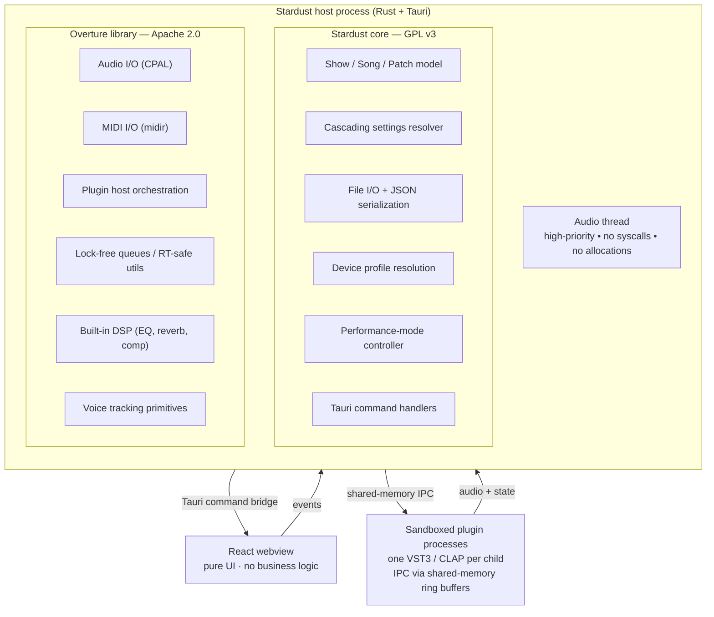

This page is the 30,000-foot view. Deep dives in linked pages.

## The stack in one diagram

## Three layers, clean separation

### 1. Overture (the library)

`Overture` is a separate Rust crate, **Apache 2.0 licensed**. It provides generic audio infrastructure:

- Audio I/O via [CPAL](https://github.com/RustAudio/cpal) — covers CoreAudio (macOS) and WASAPI (Windows)
- MIDI I/O via [midir](https://github.com/Boddlnagg/midir) — same RustAudio team, covers CoreMIDI / WinMM / ALSA
- VST3 plugin hosting via a small C++ shim around the Steinberg SDK
- CLAP plugin hosting via [`clack`](https://github.com/prokopyl/clack)
- Lock-free queues (`crossbeam`, `rtrb`)
- Built-in DSP (EQ, reverb, compression)
- Voice tracking utilities

Critically, **Overture knows nothing about Stardust**. It doesn't know what a Show is, a Patch is, or what musical theatre is. Anyone could use Overture to build a totally different audio app.

See [Overture Library](https://github.com/StardustMT/stardust-core) for the full API surface.

### 2. Stardust core (app-specific middleware)

Stardust's own Rust code, **GPL v3 licensed**. This is the middleware between the UI and the audio engine:

- Show / Song / Patch data model
- Cascading settings resolver
- File I/O for `.stardust-show` bundles
- Device profile resolution
- Performance-mode controller
- Tauri command handlers (dispatching UI requests to the engine)
- Auto-save + crash recovery

Stardust core *uses* Overture as the engine, but adds the app-specific knowledge: what a Show is, how settings cascade, how to validate before "Go Live."

### 3. React frontend (pure UI)

TypeScript + React + Tailwind + shadcn/ui. **No business logic.**

The frontend sends Tauri commands (function calls into Rust) and receives Tauri events (Rust → JS push). All UI rendering, all user input handling — nothing else.

This pattern means the same UI components can later power a mobile companion app (Tauri Mobile) without rewriting the UI for a different backend.

See Screen Inventory for every screen and component.

## Process model

### Why is Overture in-process with Stardust core?

Audio processing must happen in the same process as the orchestration code, because IPC latency would kill real-time performance. Tauri commands are *function calls*, not HTTP — sub-microsecond overhead, effectively free.

### Why are plugins out-of-process?

Crash isolation. VST3 plugins are third-party C++ that runs on the audio thread. If a plugin segfaults — and they do, especially older ones — and it's in your main process, you lose the show.

Stardust hosts each plugin (or small group) in a **child process**. The audio engine communicates with plugins via **shared-memory ring buffers** to minimize IPC latency (~1 ms typical). If a plugin crashes, the audio engine catches the disconnect, sends all-notes-off, and either restarts the plugin or falls back gracefully — without affecting the rest of the show.

See [Plugin Sandboxing](/docs/pit/reliability/plugin-crash-isolation/) for details.

## What lives where

| Concern | Layer |
|---|---|
| "What's the current Song?" | Stardust core |
| "Load this VST3 plugin" | Stardust core asks Overture |
| "Audio thread loop" | Overture |
| "Show / Song / Patch types" | Stardust core |
| "Lock-free queue between UI and audio" | Overture (Stardust core uses it) |
| "Cascading settings resolution" | Stardust core |
| "Plugin sandboxing IPC" | Overture |
| "Performance-mode validation" | Stardust core |
| "Rendering the Live Mode keyboard widget" | React frontend |
| "Click handler sends Tauri command" | React frontend |

## Why this architecture

Each layer has a clean purpose:

- **Overture** can be reused by anyone building Rust audio software — earning trust + community
- **Stardust core** can iterate on app concepts without breaking the audio engine
- **React frontend** can be rewritten or shared with mobile without touching Rust

The license split (Apache 2.0 lib, GPL 3 app) intentionally reinforces this: the library wants maximum adoption, the app wants protection from closed-source forks.

See the license decision write-up for the why.

## Related pages

- [Tauri Stack](/docs/pit/architecture/tauri-stack/)
- [Plugin Sandboxing](/docs/pit/reliability/plugin-crash-isolation/)
- [Real-Time Audio](/docs/pit/reliability/latency-budget/)
- Data Model
- File Format
- [Overture Library](https://github.com/StardustMT/stardust-core)
- [ADR: Why Rust + Tauri](/docs/pit/architecture/tauri-stack/)
- License Split
