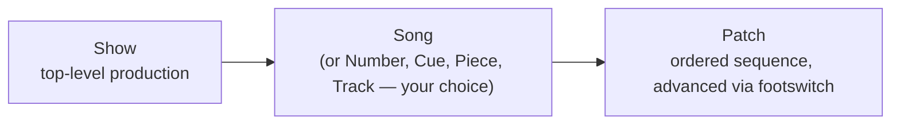

The core mental model of Stardust is a three-level hierarchy:

## Show

A **Show** is the top-level container — the production you're playing. Examples: "Hamilton (2026 Production)", "Hadestown Summer Tour", "Little Shop of Horrors — Community Theatre."

A Show owns:
- **Settings**: audio device, MIDI device list, channel routing, master volume, click track
- **UI layout**: the default Perform-mode arrangement
- **Terminology**: what to call sub-items (default `Song`, but you can use `Number`, `Cue`, `Piece`, `Track`, `Set`, `Item`, or custom)
- **Songs**: the ordered list of items in the show

## Song

A **Song** (or whatever you've named the unit) is one item in the show — typically one number/song/cue.

A Song owns:
- **Settings overrides** (optional — anything not overridden inherits from the Show)
- **UI layout override** (optional)
- **Patches**: an ordered sequence (see below)
- **Notes**: markdown-rendered show notes / lyrics / chord chart
- **Click track config**: BPM, time signature, count-in
- **Transpose**: pitch shift (semitones)
- **Cues**: MIDI-event triggers that fire actions during this Song

> **Why "Song" and not "Number"?** "Number" is musical-theatre / dance-coded. "Song" is universal across all music contexts. The internal name is `Song` but you can display it as anything per-Show via the Show settings dropdown.

## Patch

A **Patch** is a single sound configuration — the actual instrument(s) you're playing through. Within a Song, you have an **ordered list of patches** that you advance through (typically with a footswitch).

Example: in the prologue of *Little Shop of Horrors*, Keys 2 might be:
- Patch 1: Whistle sound
- Patch 2: Celeste bells
- Patch 3: Sustained pad

You advance through these mid-song with a footswitch. Stardust pre-loads N±1 patches in memory so the switch is instant.

A Patch owns:
- **Settings overrides** (optional)
- **UI layout override** (optional)
- **VST chain**: the plugins active for this patch (instruments + effects)
- **Effects**: built-in inserts (EQ, reverb, compression)
- **MIDI mappings**: which control sources affect which plugin parameters
- **Transition**: how to enter this patch (immediate / fade / crossfade)

## Why this hierarchy?

Real musical-theatre keyboardists don't have a flat list of "sounds" — they have a structured show:

- A show has a known order of numbers
- Each number sometimes needs multiple sounds (whistle → bells → pad)
- Some settings (your MIDI rig, your audio output) are constant across the whole show; setting them once per show, not once per patch, saves hours

This three-level model matches the real workflow: program your rig once at Show level, then design Songs and the Patches within them. Settings cascade down — see [Cascading Settings](/docs/pit/concepts/cascading-settings/).

## Patch transitions

When you advance from Patch N to Patch N+1, several things happen:

1. **All notes held on the outgoing patch** are either:
   - Released cleanly (default — sounds natural)
   - Cut immediately (configurable per patch)
   - Carried over to the new patch (rare; for sustained pads)
2. **The new patch's VST chain is already loaded** (we pre-load adjacent patches)
3. **A configurable transition** plays — immediate, short fade, or crossfade
4. **MIDI mappings** swap to the new patch's mappings instantly

See [Voice Tracking](/docs/pit/reliability/voice-tracking/) for how this avoids stuck notes between patches.

## Direct jump

In addition to next/prev advance, you can:
- Press **1–9** on the keyboard to jump directly to that patch in the current Song
- **Footswitch jump** — assign specific footswitches to specific patches
- **MIDI cue** — incoming MIDI message can trigger a patch jump (e.g. conductor's cue note)

See [Patch Sequencing](/docs/pit/features/patch-sequencing/) for the full picture.

## Related pages

- [Cascading Settings](/docs/pit/concepts/cascading-settings/)
- [Setup, Program, and Perform](/docs/pit/concepts/setup-program-perform/)
- [Patch Sequencing](/docs/pit/features/patch-sequencing/)
- Data Model
- [Why we chose this hierarchy](/docs/pit/concepts/shows-songs-patches/)
