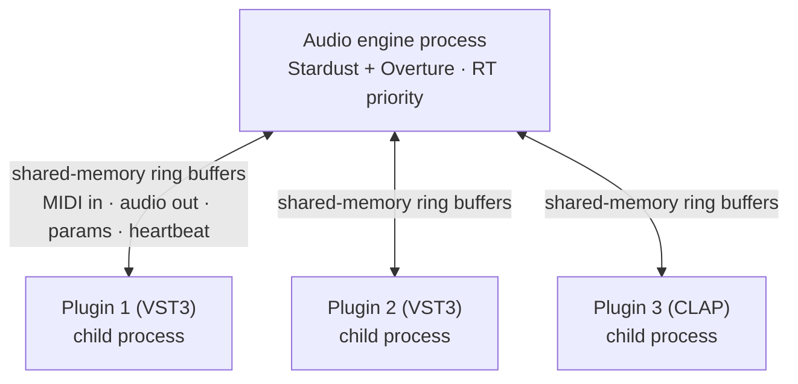

> A crashing VST plugin must not take down the show. Stardust achieves this via out-of-process plugin hosting.

**Target version:** v0.3 (the entire point of v0.3)

## The problem

VST3 plugins are third-party C++ code that runs on the audio thread. They can have bugs. They can segfault. When this happens in a host that runs plugins **in-process** — which is most live hosts — the host crashes. The show stops.

For live performance, that's not an acceptable failure mode.

## The solution

**Out-of-process plugin hosting** — every plugin (or small group) runs in a child process. Plugin and audio engine communicate via **shared-memory ring buffers**.

If a plugin segfaults:
1. The audio engine catches the process disconnect on the next callback
2. Sends `all-notes-off` to all channels (preventing stuck notes from the dead plugin)
3. Restarts the plugin or falls back to silence + sustain-off
4. UI shows a notification toast
5. Show continues

## Architecture

## IPC: shared-memory ring buffers

Why shared memory and not pipes / sockets / Unix domain sockets:
- **Lowest latency** — under 1 ms typical
- **Lock-free** — no kernel mediation per message
- **Real-time-safe** — bounded operations, no blocking
- **High throughput** — audio data is large; pipes would be slow

Each plugin process gets:
- One inbound ring buffer (MIDI + parameter changes)
- One outbound ring buffer (audio output)
- A heartbeat byte that updates each callback cycle

## Crash detection

The audio thread checks each plugin's heartbeat every callback. If the heartbeat hasn't updated:
- After 1 missed cycle: warning logged (could be a brief hang)
- After 3 missed cycles: plugin treated as crashed; cleanup initiated

Plus the OS itself signals the parent when a child process exits (via `SIGCHLD` on Unix, `WaitForSingleObject` on Windows) — we use both signals for redundancy.

## Recovery flow

When a crash is detected:

1. **Within current audio callback**: substitute silence for the dead plugin's output (no clicks, no glitches in the mix)
2. **Send all-notes-off** for any voices the plugin was processing (via voice tracker)
3. **Mark plugin as crashed** in state
4. **UI notification**: "Spitfire BBC SO Discover crashed — restarted" (toast, non-blocking)
5. **Spawn replacement process** (~200-500 ms)
6. **Reload plugin state** (parameter values, etc.)
7. **Resume processing** as soon as ready

If the plugin crashes **twice** within the same session, mark it as quarantined:
- Audio routing skips it until the user manually re-enables
- UI shows a persistent warning

## Pre-show validation includes plugin health

Before "Go Live," validate:
- All plugins start cleanly
- No quarantine flags from previous session
- Memory usage reasonable

See [Pre-Show Validation](/docs/pit/reliability/pre-show-validation/).

## Performance cost

Sandboxing adds:
- **~1 ms latency** per plugin (IPC overhead) — round-trip through shared memory
- **~10-30 MB memory** per plugin process (the runtime overhead)
- **~5% CPU** for the IPC layer (mostly the memory barriers)

Worth every microsecond. The reliability gain is incomparable.

## Sandboxing levels

Three modes:
- **Strict** (default for production): every plugin in its own process. Maximum isolation.
- **Grouped** (CPU-constrained machines): multiple plugins per process, smaller groups. Compromise.
- **In-process** (debug only): plugins in the main process for development. **Never use in production.**

User toggleable in Settings → Performance. Default is Strict for production.

## What we test

CI runs a **chaos test**:
- Load a Show with 10 plugins across multiple Songs/Patches
- Periodically `kill -9` random plugin processes during playback
- Assert: no audio dropout > 100 ms, no stuck notes, no crash of main process, all plugins recover within 500 ms

If chaos test fails, build doesn't ship.

## Phase status

| Phase | What's available |
|---|---|
| v0.2 | In-process hosting (no sandboxing) — for development only |
| v0.3 | Full sandboxing with crash recovery, heartbeat, restart |
| v0.4 | Sandboxing UI controls + per-plugin memory limits |
| v0.5+ | Plugin profiling, per-plugin CPU budgets |

## Related pages

- **Plugin Sandboxing** <!-- TODO: dead wiki link to 'Architecture: Plugin Sandboxing' --> (technical deep dive)
- [Pre-Show Validation](/docs/pit/reliability/pre-show-validation/)
- [Voice Tracking](/docs/pit/reliability/voice-tracking/)
- [Latency Budget](/docs/pit/reliability/latency-budget/) (where the 1ms goes)
- [Plugin Hosting](/docs/pit/features/plugin-hosting/)
